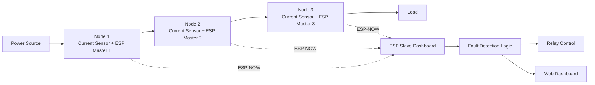
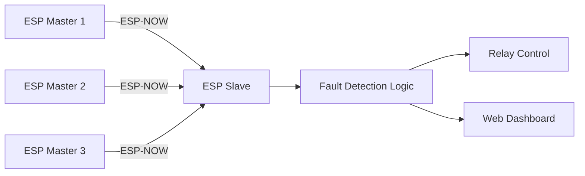

# Real-Time Low Voltage Line Fault Detection System

## Overview

A distributed IoT-based fault detection system designed for real-time monitoring of low-voltage power distribution lines. The system uses multiple ESP8266-based sensing nodes to measure current at different points of a distribution line and wirelessly transmit the readings using ESP-NOW. A central monitoring node analyzes the received data, determines the fault location, and provides live status monitoring through a web dashboard.

The project enables rapid fault localization, reduced maintenance time, and improved reliability of low-voltage distribution networks.

---

## Features

* Real-time current monitoring
* Wireless node-to-node communication using ESP-NOW
* Distributed sensing architecture
* Automatic fault localization
* Web-based monitoring dashboard
* Low-cost ESP8266 implementation
* RMS current measurement
* Relay control for fault isolation
* Expandable multi-node architecture

---

## System Architecture



---

## Communication Flow



---

## Fault Detection Logic

The system compares current measurements from multiple sensing nodes.

### Possible Conditions

| Condition                              | Interpretation                  |
| -------------------------------------- | ------------------------------- |
| Current present at all nodes           | Line healthy                    |
| Current at Node 1 only                 | Fault after Node 2              |
| Current at Node 1 and Node 2 partially | Fault between Node 1 and Node 2 |
| No current at any node                 | Fault before Node 1             |

### Thresholds Used

```cpp
node1Threshold = 0.15 A
node2Threshold = 0.15 A
node1node2Threshold = 0.25 A
```

Decision logic:

```text
Both currents detected
        │
        ▼
   System Healthy

Node 1 only active
        │
        ▼
 Break after Node 2

Node 2 abnormal
        │
        ▼
Break between Node 1 & Node 2

No current
        │
        ▼
Break before Node 1
```

---

## Folder Structure

```text
Real-Time-Low-Voltage-Line-Fault-Detection-System
│
├── ESP_Master_1
│   └── Current sensing node 1
│
├── ESP_Master_2
│   └── Current sensing node 2
│
├── ESP_Master_3
│   └── Current sensing node 3
│
├── ESP_Slave_UART_Final
│   └── Central receiver
│   └── Fault analysis
│   └── Logging framework
│   └── Notification support
│
├── ESP_Slave_WebDashboard
│   └── Web dashboard
│   └── ESP-NOW receiver
│   └── Relay control
│
└── Additional Experimental Modules
    ├── CurrentSensor
    ├── FlexSensor
    ├── SDCardESP32
    ├── MAC_Address
    └── Backup Implementations
```

---

## Module Description

### ESP_Master_1

* Current measurement node
* RMS current calculation
* ESP-NOW transmission
* Board ID = 1

### ESP_Master_2

* Current measurement node
* RMS current calculation
* ESP-NOW transmission
* Board ID = 2

### ESP_Master_3

* Current measurement node
* RMS current calculation
* ESP-NOW transmission
* Board ID = 3

### ESP_Slave_UART_Final

Central monitoring unit responsible for:

* Receiving sensor data
* Fault analysis
* Time synchronization
* SD card logging
* Telegram notification support
* Relay control

### ESP_Slave_WebDashboard

Provides:

* Live monitoring dashboard
* Fault visualization
* ESP-NOW packet reception
* Web server interface
* Remote system status access

---

## Technology Stack

### Hardware

* ESP8266
* ACS712 Current Sensor (or equivalent)
* Relay Module
* Low Voltage Distribution Line Model
* Power Supply

### Software

* Arduino IDE
* ESP8266 Core
* ESP-NOW Protocol
* ESP8266WebServer
* WiFi Library
* UART Communication
* NTP Client
* SD Card Library
* Telegram Bot API

---

## Current Measurement Algorithm

The master nodes calculate RMS current using:

```cpp
RMS = sqrt(sum(samples²)/N)
```

Process:

1. Read analog samples
2. Remove sensor offset
3. Compute square of samples
4. Calculate mean square
5. Compute RMS value
6. Convert to current using calibration factor

---

## Data Packet Structure

```cpp
struct struct_message {
    int id;
    float x;
    float y;
};
```

Where:

* id → Node Identifier
* x → Current Sensor Reading
* y → Additional Sensor Reading

---

## Web Dashboard

The dashboard provides:

* Live fault status
* System health indication
* Relay state monitoring
* Real-time updates
* Remote accessibility over WiFi

---

## Future Enhancements

* Cloud integration
* Mobile application
* MQTT support
* Historical analytics
* GIS fault visualization
* Multiple feeder support
* Predictive maintenance using Machine Learning

---

## Authors

Ayush Uttam, Anuj Kumar Mishra and Satyam Singh